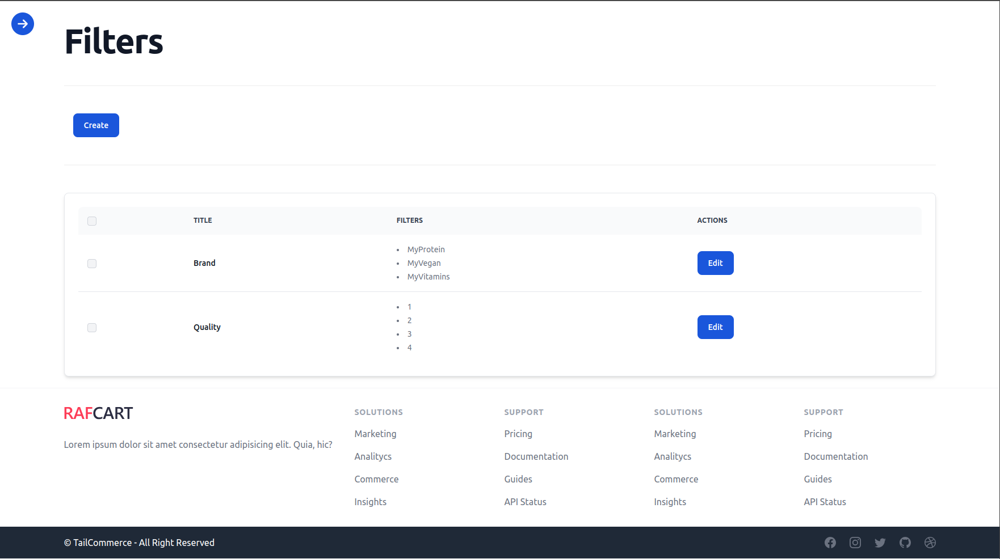

# KPWorkOut

## Introducción

**KPWorkOut** es una tienda online dedicada a la venta de productos enfocados al mundo de los gimnasios. Esta plataforma permite al administrador gestionar las categorías de productos de manera eficiente y está diseñada para cubrir las necesidades de los entusiastas del deporte que buscan facilidad y diversidad en sus compras online.

## Objetivos y Motivación

El proyecto nace de la necesidad de crear una tienda online que no solo ofrezca una amplia gama de productos relacionados con el deporte, sino que también permita al administrador una gestión fácil y dinámica de las categorías y productos ofrecidos, asegurando una experiencia de usuario óptima.

## Tecnologías Usadas

- **Backend:** Laravel 10
- **Frontend:** React
- **Base de datos:** MySQL
- **Estilos:** Tailwind CSS
- **Pagos:** Stripe

## Requisitos Previos

Para ejecutar este proyecto, necesitarás tener instalado:
- Node 20
- PHP 8
- Cliente MySQL
- Dependencias de React y Laravel

## Instalación

### Frontend (React)
1. Cambia el nombre del archivo dentro de `src/` de `secrets.example.js` a `secrets.js` y actualiza las credenciales según las que vayas a utilizar.
2. Ejecuta `npm install` dentro de la carpeta `frontend`.

### Backend (Laravel)
1. Navega a la carpeta `backend`.
2. Ejecuta `php artisan jwt:secret` para generar la `jwt_secret` necesaria para la autenticación JWT.
3. Actualiza las credenciales de la base de datos en el archivo de configuración con las de tu entorno.
4. Instala las dependencias de Laravel con `composer install`.

### Base de Datos (MySQL)
1. Crea la base de datos que utilizará el proyecto utilizando tu cliente MySQL preferido o mediante la línea de comandos.

## Características

### Cliente
- **Home:** Banner de bienvenida, menú de categorías, listado de categorías y nuevos productos.
- **Shop:** Búsqueda, listado de productos con orden y paginación, filtros dinámicos, detalles de productos.
- **Contact:** Formulario de contacto.
- **Profile:** Gestión de perfil, historial de pedidos, favoritos y carrito para usuarios registrados.
- **Checkout:** Formulario de pedido y pago.
- **ProductDetails:** Detalles y opciones de producto, productos relacionados.

### Administrador
- **Dashboard:** Gestión de productos y categorías.
- **Categorías:** Creación, edición y eliminación de categorías y subcategorías.
- **Filtros:** Gestión de filtros de productos.
- **Productos:** Lista y gestión de productos.
- **Pedidos:** Gestión y actualización de pedidos.

### Demo
    Home

    
    Shop

    Product

    Contact

    Login

    Register

    Profile

  

    
Orders

    
  

  

    
WishList

    
  

  

    
Cart

    
  

    CheckOut

    Payment Stripe

    Admin Dashboard

  

    
Categories

    
  

  

    
Products

    
  

  

    
Filters

    
  

  

    
Orders

    
  

    Admin Product

## Licencia

Este proyecto se distribuye bajo la licencia MIT, lo que permite a otros usar, modificar y distribuir el software bajo los términos de dicha licencia.